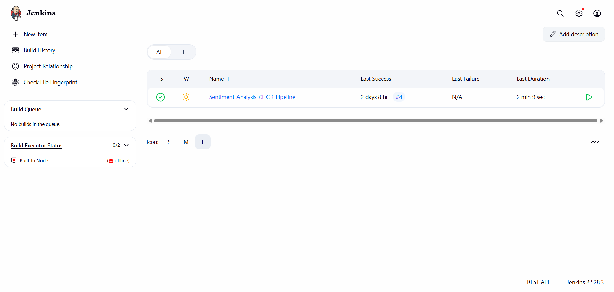
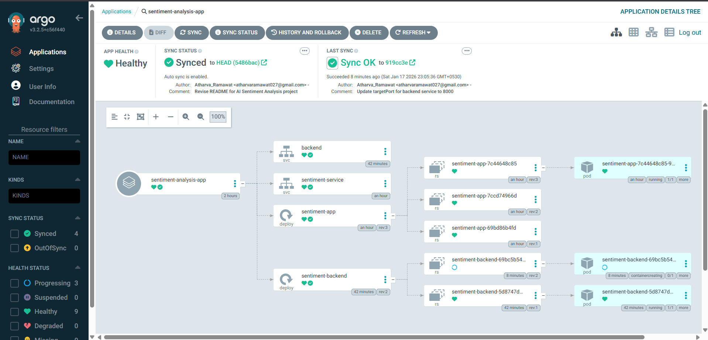

<<<<<<< HEAD
# 🎭 AI Sentiment Analysis (Jenkins + Argo CD + Kubernetes)

A full-stack AI application that analyzes the sentiment of user text (Positive, Negative, Neutral). This project demonstrates a complete **DevSecOps** workflow using **Jenkins** for CI, **Argo CD** for GitOps CD, and **Kubernetes** for orchestration.
=======
# 🎭 AI Sentiment Analysis on Kubernetes (Argo CD)

A full-stack AI application that analyzes the sentiment of user text (Positive, Negative, Neutral). This project demonstrates a complete **GitOps** workflow using **Argo CD** for continuous delivery to a Kubernetes cluster.
>>>>>>> 5486bacc5dcd072e0ae5181bce044c35026f2757

## 🚀 Live Demo
You can access the live application here:
👉 **[http://13.232.227.254:30007](http://13.232.227.254:30007)**

---

<<<<<<< HEAD
## 📸 Project Visuals

### 1. The Application UI

*Streamlit Frontend communicating with FastAPI Backend to analyze text sentiment.*

### 2. CI/CD Pipeline (Jenkins)

*Automated CI pipeline in Jenkins that builds Docker images and runs tests.*

### 3. GitOps Deployment (Argo CD)

*Argo CD visualizing the real-time synchronization of the Frontend and Backend microservices.*
=======
## 📸 Screenshots

### 1. The Application UI

*Streamlit Frontend communicating with FastAPI Backend.*

### 2. Argo CD Deployment Graph

*Visualizing the microservices architecture (Frontend & Backend) in Argo CD.*
>>>>>>> 5486bacc5dcd072e0ae5181bce044c35026f2757

---

## 🛠️ Tech Stack

* **Frontend:** [Streamlit](https://streamlit.io/) (Python) - Port `8501`
* **Backend:** [FastAPI](https://fastapi.tiangolo.com/) (Python) - Port `8000`
<<<<<<< HEAD
* **CI Pipeline:** Jenkins (Automated Build & Push)
* **CD Pipeline:** Argo CD (GitOps)
* **Containerization:** Docker
* **Orchestration:** Kubernetes (K3s/K8s)
=======
* **Containerization:** Docker
* **Orchestration:** Kubernetes (K3s/K8s)
* **CD Pipeline:** Argo CD (GitOps)
>>>>>>> 5486bacc5dcd072e0ae5181bce044c35026f2757
* **Cloud Infrastructure:** AWS EC2

---

## 🏗️ Architecture

The application follows a microservices architecture deployed on Kubernetes:

<<<<<<< HEAD
1.  **Developer Push:** Code changes are pushed to GitHub.
2.  **Jenkins CI:** Automatically triggers a build, creates Docker images, and pushes them to Docker Hub.
3.  **Argo CD:** Detects the new changes in the manifest files and syncs them to the Kubernetes cluster.
4.  **Kubernetes:** Runs the application pods (Frontend & Backend) and exposes them via NodePort Services.
=======
1.  **Frontend Service:** Exposed via NodePort `30007`. It accepts user input and sends a POST request to the backend.
2.  **Backend Service:** An internal service running FastAPI. It processes the text using a pre-trained ML model and returns the sentiment score.
3.  **Argo CD:** Monitors this repository. Any change to the `deployment.yaml` files is automatically synced and deployed to the cluster.
>>>>>>> 5486bacc5dcd072e0ae5181bce044c35026f2757

---

## ⚙️ Installation & Deployment

To deploy this on your own Kubernetes cluster:

1.  **Clone the repository:**
    ```bash
    git clone [https://github.com/Atharva-Ramawat/sentiment-analysis-jenkins-argocd.git](https://github.com/Atharva-Ramawat/sentiment-analysis-jenkins-argocd.git)
    cd sentiment-analysis-jenkins-argocd
    ```

2.  **Apply the Kubernetes Manifests:**
    ```bash
    # Deploy Backend
    kubectl apply -f backend-deployment.yaml
    kubectl apply -f backend-service.yaml

    # Deploy Frontend
    kubectl apply -f deployment.yaml
    kubectl apply -f service.yaml
    ```

3.  **Access the App:**
    The frontend will be available at `http://<YOUR-NODE-IP>:30007`.

---

## 🤝 Contributors
<<<<<<< HEAD
* **Atharva Ramawat** - *DevOps & Full Stack Implementation*
=======
* **Atharva Ramawat** - *DevOps & Full Stack Implementation*
>>>>>>> 5486bacc5dcd072e0ae5181bce044c35026f2757
